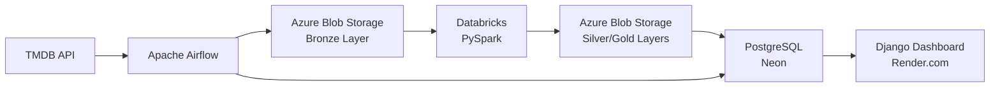

# CineTrends Pipeline

**End-to-end data engineering project** analyzing movie & TV trends from The Movie Database (TMDB).

Built with: **PySpark** · **Apache Airflow** · **Databricks** · **Django** · **Pandas** · **Azure Blob Storage** · **PostgreSQL**

## Live Demo

**[View the Dashboard on Render.com](https://cinetrends-pipeline.onrender.com)**

> **Note for Reviewers:** This live demo is a static snapshot populated with sample data to provide immediate, hassle-free access to the UI and analytics features. 
> The full, end-to-end functionality—where Apache Airflow automatically fetches daily updates from the TMDB API, processes the data, and loads it into the database—is designed to be run locally via Docker.

## Project Overview

CineTrends is a comprehensive data engineering portfolio project that demonstrates a complete ETL lifecycle:

1. **Extracts** trending movies, TV shows, and people from the [TMDB API](https://developer.themoviedb.org/) daily.
2. **Loads** raw data to Azure Blob Storage (data lake, Medallion Architecture)
3. **Transforms** data using PySpark/Pandas with window functions, aggregations, and data quality checks
4. **Orchestrates** the workflow with Apache Airflow (3 DAGs: daily, weekly, monthly)
5. **Serves** insights via an interactive Django dashboard with Plotly.js charts

### Architecture

```
TMDB API → Airflow → Azure Blob (Bronze/Silver/Gold) → Databricks → PostgreSQL → Django Dashboard
```



## Tech Stack

| Layer | Technology | Purpose |
|-------|-----------|---------|
| **Source** | TMDB API v3 | Trending movies, TV shows, people, genres |
| **Orchestration** | Apache Airflow 2.9 | 3 DAGs (daily/weekly/monthly), TaskGroups, XCom |
| **Data Lake** | Azure Blob Storage | Hive-partitioned JSON/Parquet (Bronze/Silver/Gold) |
| **Processing** | PySpark + Pandas | Window functions (LAG, DENSE_RANK), rolling averages, ROI |
| **Notebooks** | Databricks Free Edition | 4 notebooks for Medallion Architecture transformations |
| **Data Warehouse** | PostgreSQL (Neon) | Star schema: 3 dims, 2 bridges, 1 fact, 2 aggregations |
| **Dashboard** | Django 5.1 + DRF | 6 pages, REST API, HTMX interactivity |
| **Charts** | Plotly.js | 5 chart types with dark theme |
| **Deployment** | Docker + Render.com | Containerized Airflow, free-tier web hosting |

## Project Structure

```
cinetrends-pipeline/
├── etl/                          # ETL package
│   ├── extractors/
│   │   ├── base_extractor.py     # Abstract base class
│   │   └── tmdb_extractor.py     # TMDB API client with rate limiting
│   ├── transformers/
│   │   ├── pandas_transformers.py # Pandas transformations
│   │   └── spark_transformers.py  # PySpark window functions
│   └── loaders/
│       ├── azure_blob_loader.py  # Azure Blob Storage (Hive partitions)
│       └── postgres_loader.py    # PostgreSQL upserts (INSERT ON CONFLICT)
│
├── databricks/notebooks/         # Databricks notebooks
│   ├── 01_raw_to_bronze.py       # Ingest raw JSON → Parquet
│   ├── 02_bronze_to_silver.py    # Dedupe, type cast, quality checks
│   ├── 03_silver_to_gold.py      # Window functions, aggregations
│   └── 04_gold_to_postgres.py    # JDBC load to warehouse
│
├── airflow/                      # Airflow orchestration
│   ├── dags/
│   │   ├── tmdb_daily_extract.py # Daily: extract → blob → transform → load
│   │   ├── tmdb_weekly_enrichment.py # Weekly: enrich details + aggregate
│   │   └── tmdb_monthly_aggregation.py # Monthly: genre rollups
│   ├── plugins/hooks/
│   │   └── tmdb_hook.py          # Custom Airflow Hook
│   └── Dockerfile
│
├── dashboard/                    # Django web app
│   ├── config/                   # Settings (base/dev/prod), URLs, WSGI
│   ├── trends/                   # Main app
│   │   ├── models.py             # Star schema models (8 tables)
│   │   ├── views.py              # 6 class-based views
│   │   ├── api/                  # DRF REST API
│   │   ├── templates/            # Dark theme templates + HTMX
│   │   ├── static/               # CSS, Plotly.js charts, HTMX handlers
│   │   ├── templatetags/         # Custom filters (trend_arrow, format_currency)
│   │   └── management/commands/
│   │       └── seed_data.py      # 25 real movies, 15 actors, 30 days data
│   ├── Procfile                  # Render.com deployment
│   └── requirements.txt
│
├── tests/                        # Unit tests
├── docker-compose.yml            # Airflow + PostgreSQL
├── Makefile                      # Developer commands
├── requirements.txt              # Root dependencies
└── .env.example                  # Environment template
```

## Local Development Setup

You can run the dashboard locally in minutes using the provided sample data—no API keys required.

### 1. Clone & Setup

```bash
git clone https://github.com/YOUR_USERNAME/cinetrends-pipeline.git
cd cinetrends-pipeline

# Create virtual environment
python -m venv .venv
source .venv/bin/activate

# Install dependencies
make install
# or: pip install -r requirements.txt

# Configure environment
cp .env.example .env
# Edit .env with your API keys
```

### 2. Get TMDB API Key (Optional)

*Note: You only need this if you want to run the Airflow ETL pipeline to fetch fresh data. To just view the dashboard with sample data, skip to Step 3.*

1. Sign up at [themoviedb.org](https://www.themoviedb.org/signup)
2. Go to Settings → API → Create API Key
3. Copy the **Read Access Token** to `TMDB_ACCESS_TOKEN` in `.env`

### 3. Run Django Dashboard (Local)

```bash
# Migrate database (SQLite by default)
make django-migrate

# Seed the database with realistic sample data (No API key needed!)
make seed

# Start server
make django-run
# Open http://localhost:8000
```

### 4. Run Airflow (Docker)

```bash
make airflow-up
# Open http://localhost:8080 (admin/admin)
```

### 5. Run Tests

```bash
make test
```

## Dashboard Pages

| Page | Description |
|------|-------------|
| **Dashboard** | KPIs, genre donut chart, popularity timeline, top trending |
| **Daily Trends** | HTMX-filtered cards with position badges and arrows |
| **Weekly Analysis** | Position change charts, top movers, data table |
| **Monthly Report** | Genre bar charts, budget vs revenue scatter plot |
| **Movie Detail** | Backdrop hero, financial stats, popularity timeline, cast |
| **Actor Profile** | Photo, popularity, filmography grid |

## Data Engineering Skills Demonstrated

- **ETL Design**: Abstract base classes, rate limiting, retry logic (tenacity)
- **PySpark**: Window functions (`LAG`, `DENSE_RANK`, `ROW_NUMBER`), rolling averages
- **Apache Airflow**: TaskGroups, XCom, custom Hooks, 3 scheduled DAGs
- **Databricks**: Medallion Architecture (Bronze/Silver/Gold), Spark notebooks
- **Data Modeling**: Star schema, dimension/fact/bridge tables, SQL upserts
- **Azure**: Blob Storage with Hive-style partitioning
- **Django/DRF**: REST API, class-based views, HTMX dynamic content
- **Testing**: pytest fixtures, mocking, data quality assertions
- **DevOps**: Docker Compose, Makefile, Render.com deployment

## License

MIT License - Built as a portfolio project.

*Data provided by [The Movie Database (TMDB)](https://www.themoviedb.org/). This product uses the TMDB API but is not endorsed or certified by TMDB.*
